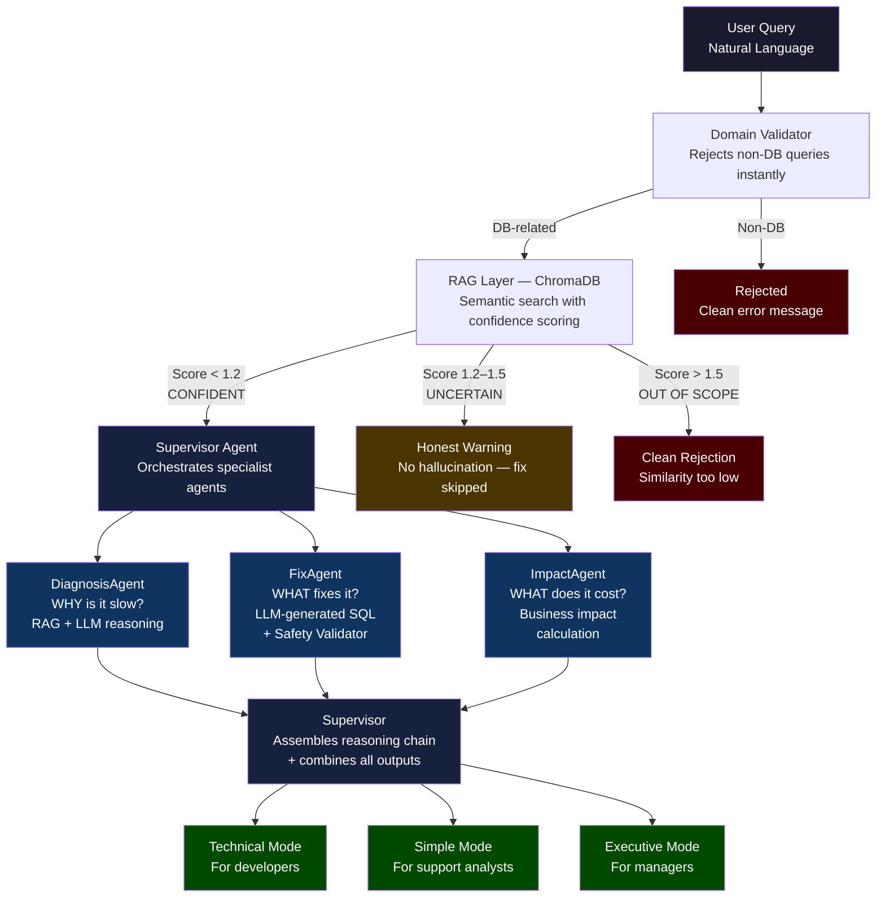

# AI SQL Performance Analyzer
### Multi-Agent RAG System for Database Reliability Engineering

**Submitted by:** Abinaya T  
**College:** Madras Institute of Technology, Anna University  
**CGPA:** 8.99 | B.Tech Information Technology (2022–2026)  
**GitHub:** [solartis-hackathon-abinaya-t-92](https://github.com/Abinaya-092/solartis-hackathon-abinaya-t-92)

---

## Problem Understanding

In any data-intensive system, database performance is mission-critical. A single slow SQL query can cascade into system-wide degradation — affecting real users, real operations, and real revenue.

**The core challenge:**
- Junior developers and support engineers lack the expertise to diagnose database performance issues that senior DBAs resolve intuitively
- Mean Time To Resolution (MTTR) for slow queries is 30–60 minutes of manual analysis
- As data grows, undetected query patterns silently degrade into production incidents

**This system solves it by acting as an "Expert-in-a-Box"** — a multi-agent AI system that diagnoses, fixes, and explains database performance issues in seconds, for any audience.

---

## Architecture



---

## Key Features

### 1. Multi-Agent Supervisor Architecture
Three specialist agents orchestrated by a Supervisor — each with a single responsibility. The system returns a full **reasoning chain** showing every decision made, ensuring complete auditability — critical in regulated environments.

### 2. Advanced RAG with Confidence Scoring
Goes beyond basic RAG with similarity threshold scoring:
- Score < 1.2 → confident match → full analysis + fix executed
- Score 1.2–1.5 → uncertain → honest warning returned, fix skipped to prevent harm
- Score > 1.5 → out of scope → clean rejection with dynamic suggestions

The system knows what it doesn't know. No hallucinated answers on edge cases.

### 3. Agentic Fix Loop with Safety Validator
The FixAgent doesn't just suggest fixes — it **executes them** on a real database:
1. LLM generates the fix SQL autonomously
2. Safety validator whitelists only `CREATE INDEX`, `ANALYZE`, `VACUUM`
3. Fix applied to real SQLite database with 1.7M rows
4. Before/after performance measured and returned as proof
5. Fix is skipped entirely if RAG confidence is uncertain — prevents dangerous actions

### 4. Natural Language Intent Router (`/ask`)
Single endpoint that accepts anything a user types — raw SQL, plain English symptom description, or vague complaint. Intent classifier routes to the right analysis automatically.

### 5. Audience-Aware Responses
Same diagnosis, three different explanations:
- **Developer:** "Full table scan due to missing index on status column"
- **Support:** "Users experience slow query performance and increased wait times"
- **Executive:** "Business incurs significant productivity losses — urgency: HIGH"

### 6. Dynamic Suggestions on Uncertainty
When a query is too vague, the system calls an LLM to generate contextually relevant suggestions based on what the user typed — not hardcoded options. "Did you mean one of these?" with clickable suggestions.

### 7. Enriched Knowledge Base
11 SQL performance cases enriched with real-world symptoms, detection signals, fix validation steps, and domain-specific context — enabling semantic matching on natural language descriptions, not just keywords.

---

## Tech Stack

| Component | Technology |
|---|---|
| LLM | LLaMA 3.1 8B via Groq API (free) |
| Embeddings | HuggingFace all-MiniLM-L6-v2 (runs locally) |
| Vector DB | ChromaDB (persistent, local) |
| Orchestration | LangChain LCEL |
| API | FastAPI + Uvicorn |
| Database | SQLite (1.7M rows — policy, claims, logs) |
| Frontend | React + Vite |

---

## Project Structure

```
HACKATHON/
├── dataset.json          # Enriched knowledge base (11 cases)
├── README.md
├── test_all.py           # Full automated test suite
├── backend/
│   ├── main.py           # FastAPI — 7 endpoints
│   ├── supervisor.py     # Multi-agent orchestrator
│   ├── agent.py          # DiagnosisAgent
│   ├── executor.py       # FixAgent — LLM SQL + safety validator
│   ├── rag.py            # RAG layer with confidence scoring
│   ├── database.py       # SQLite schema + 1.7M row seeder
│   ├── database.db       # SQLite database (auto-generated)
│   └── .env              # GROQ_API_KEY (not committed)
└── frontend/
    ├── src/
    │   └── App.jsx       # React dashboard
    └── package.json
```

---

## How to Run

### Prerequisites — Install These First

| Tool | Download | Check if installed |
|---|---|---|
| Python 3.10+ | [python.org](https://www.python.org/downloads/) | `python --version` |
| Node.js 18+ | [nodejs.org](https://nodejs.org/) | `node --version` |
| Git | [git-scm.com](https://git-scm.com/downloads/) | `git --version` |

> After installing any tool, close and reopen your terminal before continuing.

---

### Step 1 — Get a Free Groq API Key

1. Go to [console.groq.com](https://console.groq.com) (open in new tab)
2. Create a free account
3. Click **API Keys** in the left sidebar
4. Click **Create API Key** and copy it
5. Keep it — you will need it in Step 3

---

### Step 2 — Clone the Repository

```bash
git clone https://github.com/Abinaya-092/solartis-hackathon-abinaya-t-92
cd solartis-hackathon-abinaya-t-92
```

---

### Step 3 — Create the API Key File

```bash
cd backend
```

Create a file called `.env` inside the `backend/` folder with this exact content:

```
GROQ_API_KEY=your_api_key_here
```

Replace `your_api_key_here` with the key you copied in Step 1.

On Windows PowerShell:
```bash
echo "GROQ_API_KEY=your_api_key_here" > .env
```

---

### Step 4 — Install Backend Dependencies

```bash
pip install fastapi uvicorn langchain langchain-community langchain-groq
pip install langchain-huggingface chromadb sentence-transformers python-dotenv
```

---

### Step 5 — Start the Backend

```bash
python -m uvicorn main:app --reload
```

**First run takes 3–5 minutes** — it will automatically:
- Download the HuggingFace embedding model (~90MB)
- Build ChromaDB from dataset.json
- Seed SQLite database with 1.7M rows

You will see `Uvicorn running on http://127.0.0.1:8000` when ready.

---

### Step 6 — Start the Frontend

Open a **new terminal** (keep the backend running) and navigate back to the project root:

```bash
cd solartis-hackathon-abinaya-t-92
cd frontend
npm install
npm run dev
```

Open `http://localhost:5173` in your browser.

---

### Troubleshooting

| Problem | Fix |
|---|---|
| `git is not recognized` | Install Git from git-scm.com, restart terminal |
| `pip is not recognized` | Use `pip3` instead of `pip` |
| `python is not recognized` | Use `python3` instead of `python` |
| `uvicorn is not recognized` | Use `python -m uvicorn` instead |
| ChromaDB build fails | Delete `backend/chroma_db` folder and restart server |
| Database seed fails | Delete `backend/database.db` and restart server |

---

##  Test Examples

Once the system is running, try these queries in the frontend:

### Category 1 — Happy Path (Confident Diagnosis + Fix)
```
SELECT * FROM policy_data WHERE status = 'ACTIVE' is taking too long
```
```
policy search is very slow today
```

### Category 2 — Anomaly Detection
```
my query suddenly spiked from 1 second to 50 seconds with no code changes
```
```
database was fine yesterday but extremely slow today
```

### Category 3 — Edge Cases 
```
stored procedure execution is slow
```
```
my database connection keeps timing out
```
```
how do I optimize my insurance reporting queries
```

### Category 4 — Out of Scope (Clean Rejection)
```
how do I make pasta
```
```
what is machine learning
```
```
hello
```

### Mode Testing (use same query, switch modes)
```
our database queries are slow and affecting customers
```
> Try this in Technical, Simple, and Executive modes to see audience-aware responses.


### Direct API Testing
Open `http://localhost:8000/docs` for interactive API documentation.

**POST /analyze/full**
```json
{
  "question": "SELECT * FROM policy_data WHERE status = 'ACTIVE' is slow",
  "mode": "technical"
}
```

**POST /detect/anomaly**
```json
{
  "query": "SELECT * FROM policy_data WHERE status = 'ACTIVE'",
  "baseline_time": "1s",
  "current_time": "50s"
}
```

**POST /ask**
```json
{
  "question": "why is my JSON query slow?"
}
```

---

## API Endpoints

| Endpoint | Method | Description |
|---|---|---|
| `/analyze/full` | POST | **Main endpoint** — full multi-agent analysis |
| `/ask` | POST | Natural language router with intent detection |
| `/analyze/query` | POST | Direct query analysis with confidence scoring |
| `/detect/anomaly` | POST | Anomaly detection with spike ratio calculation |
| `/suggest/optimization` | POST | Prioritized optimization list |
| `/analyze/and/fix` | POST | Agentic fix loop with before/after proof |
| `/suggest/similar` | POST | Dynamic similar query suggestions |

### Example Request
```json
POST /analyze/full
{
  "question": "SELECT * FROM policy_data WHERE status = 'ACTIVE' is taking too long",
  "mode": "technical"
}
```

### Example Response
```json
{
  "status": "success",
  "reasoning_chain": [
    "RAG confidence: CONFIDENT (score: 0.80)",
    "Delegating to DiagnosisAgent...",
    "DiagnosisAgent returned: Missing Index on Frequently Filtered Column",
    "Delegating to FixAgent...",
    "FixAgent generated safe SQL: CREATE INDEX idx_status ON policy_data(status)",
    "Safety validated: True",
    "Delegating to ImpactAgent..."
  ],
  "diagnosis": {
    "problem": "Missing Index on Frequently Filtered Column",
    "root_cause": "No index on status column forces full table scan",
    "confidence": "high",
    "similarity_score": 0.8026
  },
  "fix": {
    "sql_executed": "CREATE INDEX idx_status ON policy_data(status)",
    "safe": true,
    "validated_by": "safety_validator",
    "before_ms": 1645,
    "after_ms": 142,
    "improvement": "91.4% faster"
  },
  "impact": {
    "technical": "Full table scan on every query due to missing index",
    "user_facing": "Users experience slow policy search across all modules",
    "executive": "Business incurs productivity losses — HIGH urgency",
    "urgency": "high — impacts all users on every query"
  }
}
```

---

## Design Decisions & Trade-offs

### Why SQLite over MySQL/PostgreSQL?
SQLite requires zero installation — evaluators can run the system with a single command. In production, the system would connect to managed PostgreSQL (Supabase/RDS) with connection pooling. The agentic fix loop works identically regardless of the database backend.

### Why LLM-generated SQL over hardcoded patterns?
Early versions used keyword-matching to map diagnoses to SQL fixes. This was brittle — "add index on status" and "create an index for the status field" would fail to match the same pattern. The LLM-generated approach handles any phrasing and any column name, while the safety validator ensures nothing dangerous executes.

### Why fix is skipped on uncertain confidence?
Executing a database fix based on a wrong diagnosis is worse than not fixing at all. If RAG confidence is uncertain (score 1.2–1.5), the system provides the diagnosis as a best guess but deliberately skips fix execution. This is a conscious safety decision — not a limitation.

### RAG Strategy Decisions
I evaluated four advanced RAG strategies:
- **HyDE** — rejected. At 11 cases, retrieval precision is already high. Would reconsider at 1000+ cases.
- **Reranking** — rejected. LLM reranking doesn't scale; production would need Cohere Rerank.
- **Multi-query retrieval** — rejected. Triples search cost with marginal benefit at small scale.
- **Similarity threshold** — implemented. Zero cost, scales perfectly, prevents hallucination on edge cases.

### Why three separate agents instead of one LLM call?
Single responsibility principle. Each agent has one job, one system prompt, one output schema. This makes the system debuggable, testable, and extensible. Adding a new agent (e.g., a PredictionAgent for future trajectory) requires zero changes to existing agents.

### Why LLM-based domain validation over keyword matching?
Early versions used a fixed keyword list for domain validation. This rejected valid queries like "how do I optimize my insurance reporting queries" because "insurance" wasn't in the list. The current approach uses fast keyword matching for obvious cases, then falls back to an LLM call for ambiguous queries — giving flexibility without sacrificing accuracy.

---

## Production Scaling Considerations

*Answering the mandatory question: "If you were designing this system for production at scale, what would you change or improve?"*

**1. Vector Database**
Replace ChromaDB with Pinecone or pgvector for millions of cases with horizontal scaling.

**2. LLM Calls**
At 50 requests/minute, 4–5 LLM calls per request = 200–250 Groq calls/minute. Production needs response caching for similar queries, async processing, and batch analysis for non-urgent requests.

**3. Prompt Management**
Replace manual prompt tuning with automated eval pipelines. Libraries like Guardrails AI would enforce output schemas. LangSmith would provide observability into failure patterns across thousands of requests.

**4. Feedback Loop**
Collect user feedback on diagnosis accuracy. Feed successful fixes back into the knowledge base automatically (Institutional Memory pattern). System improves with usage.

**5. Real Database Integration**
Connect to actual MySQL/PostgreSQL production database. Read `EXPLAIN` output directly. Apply fixes with rollback capability. Measure real query plans, not just execution time.

**6. Agent Orchestration**
Replace custom supervisor with LangGraph for proper agent state management, conditional routing, and parallel agent execution. DiagnosisAgent and ImpactAgent could run in parallel since they're independent.

**7. Security**
Current safety validator whitelists `CREATE INDEX`, `ANALYZE`, `VACUUM`. Production needs role-based access control — read-only analysis for support teams, fix execution only for DBAs.

---

## AI Usage Disclosure

As required by the challenge guidelines:

**Tools used:** Claude (Anthropic), for architectural guidance and code review

**What I used AI for:**
- Discussing system architecture and trade-offs
- Reviewing code for bugs and improvements
- Understanding LangChain API changes between versions
- Enriching the dataset with real-world symptoms and context

**What I built and own:**
- System architecture decisions (chose SQLite over Supabase after risk analysis)
- Multi-agent supervisor design
- Safety validator logic
- Similarity threshold values (derived from real score measurements)
- All debugging and integration work
- Every line was read, understood, and intentionally placed

**What I changed/improved beyond AI suggestions:**
- Added epistemic honesty — system admits uncertainty instead of hallucinating
- Chose not to implement HyDE/reranking after analyzing production trade-offs
- Designed audience-aware responses based on real user personas
- Added fix-skipping on uncertain confidence — safety-first decision
- Dynamic suggestions generated per user input, not hardcoded

**Challenges faced:**
- LangChain version conflicts between `langchain.schema` and `langchain_core.documents`
- SQLite index performance on SSDs — learned that low-cardinality columns don't benefit from indexes when result sets are large
- LLM occasionally returning invalid JSON — solved with regex extraction and schema validation

---

## My Journey

> "I walked in with zero RAG experience and walked out with a multi-agent AI system. Here's how."

**Day 1** — Set up the stack. First working RAG pipeline. Understood embeddings by actually running them.

**Day 2** — Enriched the dataset. Built FastAPI endpoints. Added natural language routing. Broke things. Fixed things.

**Day 3** — Built the supervisor architecture. Three agents talking to each other. React frontend. This README.

**The creative decisions I'm proud of:**
- Chose SQLite over Supabase after honest risk analysis — portability over impressiveness
- Added epistemic honesty — system admits when it doesn't know instead of hallucinating
- Built audience-aware responses — same diagnosis, three different explanations
- Evaluated HyDE, reranking, multi-query RAG — and consciously chose NOT to implement them
- Skipped fix execution on uncertain confidence — because a wrong fix is worse than no fix

My temperature? Always 1. Curious, creative, and full of ideas.

---

## Dataset

11 SQL performance cases covering:
- Full table scans
- JSON field filtering (MySQL JSON_EXTRACT)
- High frequency config queries
- Complex joins with JSON processing
- Anomaly detection (sudden latency spikes)
- Nested subqueries
- Aggregation with multiple joins
- Large logging table queries
- Bulk update performance
- Knowledge base config lookups
- Missing index on filtered columns

Each case enriched with: symptoms, detection signals, domain-specific context, fix validation steps, and related patterns — enabling semantic matching on natural language descriptions.

---

*Built with curiosity, ownership, and a lot of terminal windows — Abinaya T, April 2026*